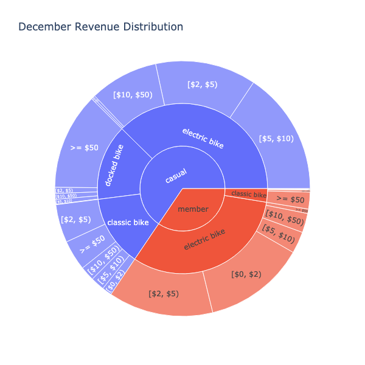

# Divvy Rideshare Analysis

TLDR: We used Divvy bikeshare data from chicago to visualize the distribution of revenue between types of bikes and types of customers (members or non-members). We also used geospatial data to track station usage over the region and the amount of station bike number surpluses/deficits for each station.

More details

Divvy is a bikeshare program owned by Lyft that aims to help people experience Chicago in a whole new way.

There are over 600 stations and 6000+ bikes across Chicago, and Divvy posts the start/end stations, start/end coordinates, and start/end times of all bike rides, along with the type of user (member or casual) and type of bike (classic, electric, or docked - not sure what docked means). There is no user info, every ride ID is unique. The data is open access and can be found at [https://ride.divvybikes.com/system-data](https://ride.divvybikes.com/system-data).

There are a few questions worth examining here. The first type of question is related to what kind of user is involved and how charges are distributed. We have start and end times and formulas to extract charges for each ride. However, we don't have the number of members, so we can't access the revenue from membership fees.

The second type of question is related to the fact that bike stations each have a fixed number of spots for bikes. This leaves a big problem if users ride up to a full bike station and cannot deposit their bikes. The bikes either need to be ridden to another station, the users need to wait for someone to open new spots at the station, or the bikes will get dropped off in somewhat random places. This could also cost users more than they planned to spend since single bike rides are limited to 30 minutes. Alternatively, users could plan to use bikes at a station but find the station empty. Either of these cases will degrade the user experience and lead to people avoiding Divvy in the future. These sorts of cases lead to the company needing people to bring the bikes back to stations or redistribute them from full stations to empty stations.

Divvy has a solution to this problem called the "Bike Angels" program, which rewards people for taking bikes from full stations and replenishing empty stations. It's still reasonable to ask how bikes stations ebb and flow to more properly use the Bike Angels rewards program, or to determine if stations could use more bike return spots or more bikes.

Some reasonable questions we can ask the data:

1. User/bike type analysis
    * How is the revenue distributed between users and bike types?
    * How does this compare to the number of rides among each type of user and bike?
2. Bike station geospatial analysis
    * How are bike stations distributed?
    * How many transactions occur in different regions of Chicago?
    * What are the approximate maximum numbers of bikes and parking spots necessary at each station?
    * Are there trends of stations that are commonly empty or commonly full?
    
Here we will start with the December 2022 dataset to develop the methods and workflow and expand to the rest of the year.

## December 2022 Bike and User Type Analysis

The analysis for this section is shown in the [Divvy_revenue_types_analysis.ipynb](Divvy_revenue_types_analysis.ipynb) notebook. 

We explored and cleaned the data set and came up with the following visualizations. Click on the images to be redirected to interactive models that give you pop-up values.

The first is the distribution of revenue generated from individual transactions (so it does not included member fees). The center pie is the distribution between casual (non-members) and members. Since members can often get by without paying for individual rides, it makes sense that more revenue comes from non-members here. The middle annulus looks at the distribution between classic, electric, and docked bikes. The outer annulus bins the rides by the cost ranges for individual transactions. 

 

The second graph looks at the analagous data, but the size of each group is proportional to the number of rides taken.

## December 2022 Station Analysis

The analysis for this section is shown in the [Divvy_geospatial_usage_suplus.ipynb](Divvy_geospatial_usage_suplus.ipynb) notebook, along with a few more geospatial visualizations. Note that this notebook should (at least on Mac systems) be opened in Jupyter Notebook rather than Jupyter Lab since Kepler graphs don't seem compatible with certain Jupyter Lab configurations.

First, we looked at the distribution of transactions (counting both starting and ending bike rides) across the city. Below is shown the transaction numbers on a linear scale as the heights of hex bins. The coloring is a log-scale representation of transation number.

Next, we approach looking at individual stations. There are a few stations that exist right across an intersection from each other, meaning it's not a big deal for users to hop across the street to park their bikes, and a few names that are repetitive. We find an H3 index resolution that splits the difference between these considerations and overlapping too many stations.

We first found that the GPS data from individual bike rides are highly scattered, likely due to coming from inaccurate GPS devices on the bikes themselves, as shown below. GPS points from bikes are shown in a white to pink color scale (white means less points in the hexagon), and stations are represented with blue hexagons.

So it is not efficient to detect stations from the bike GPS devices. We instead use the names from the bike ride data, a little cleaning, and we implement the geospatial data from the station dataset. After some manipulation, we quantify the bike surplus for each station over time. We add this data to a Kepler graph to get an interactive visualization that allows us to see when bike stations are over (surplus) or under (deficit) their median capacity. In the graph below, green represents a surplus, and purple represents a deficit. Light values mean the stations are close to the median capacity. The draggable time range can be used to see how these surpluses and deficits evolve with time. This would be useful for determining when to encourage redistributing bikes.

## Set up an airflow schedule to pull in monthly data to a PostgreSQL database

I next set up an Airflow DAG to handle downloading and uploading monthly data to a PostgreSQL database. The DAG is shown above, with a few extra nodes that can be useful for doing catchup from Jan 2021 until December 2022. The three nodes work as follows:

1. divvy-download uses Selenium to open up a webpage, load the table of data links (which required loading some javascript), find data links in the range of January 2021 to the current month, and outputs the latest link URL (it has cases to handle the airflow catchup option when the data has not been uploaded to Postgres at all yet).
2. 